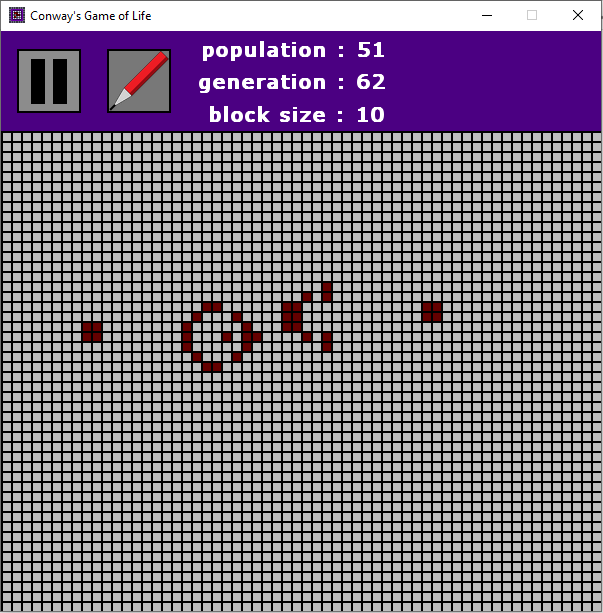
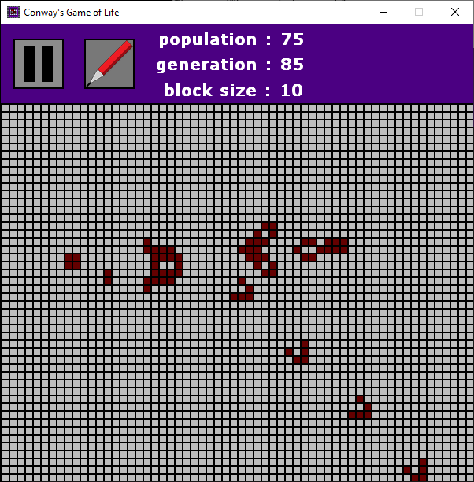

<p align="center">
  <h1>👾👨🏻‍💻 Conway's Game of Life 👨🏻‍💻👾</h1>
  <h6>by <i>FranciscoCharles</i></h6>
</p>

An interactive simulator that implements the standard Conway Game of Life with a simple menu developed in **Python** + **Pygame**. Test and experience the different types of cell automaton patterns discovered and found in this game.

<p align="center">
  
  
</p>


# <a name=index>Table of contents 📚</a>

- [**Shortcuts to change program settings**](#program_shortcuts)
- [**How can i run?**](#run)
- [**Dependencies**](#dependencies)
- [**Version**](#version)
- [**License**](#license)


# **<a name=program_shortcuts>👨🏻‍💻 Shortcuts to change program settings 🕹️</a>**  <h6>[back to indice](#index)</h6>

- use <kbd>ESC</kbd> to exit / close the program.
- use <kbd>A</kbd> to play/pause execution.
- use <kbd>S</kbd> to switch between pencil / eraser.
- use <kbd>Q</kbd> to decrease block size.
- use <kbd>W</kbd> to increase block size.
- use <kbd>Z</kbd> to clear/reset the grid.
- use <kbd>X</kbd> to clear/reset the grid and generate automatons at random positions.

# **<a name=run>How can I run? 🧠💭</a>** <h6>[back to indice](#index)</h6>

Download the project, install the dependencies, enter the `src` folder and execute:
```bash
python main.py
```

# **<a name=dependencies>🧰 Dependencies ⚙️</a>**  <h6>[back to indice](#index)</h6>
- **Pygame** == **1.9.6**.
- **Pillow** == **8.2.0**.
- **Python** == **3.7** or higher.

# **<a name=version>Version</a>**  <h6>[back to indice](#index)</h6>
- current version of the project: 1.0.1.

# **<a name=license>License</a>**  <h6>[back to indice](#index)</h6>

For more information on the license for this project read the <a href="./LICENSE" title="go to license file">LICENSE</a> file.

---

<p align="center">
    Copyright © 2021 <b>FranciscoCharles</b>
</p>
